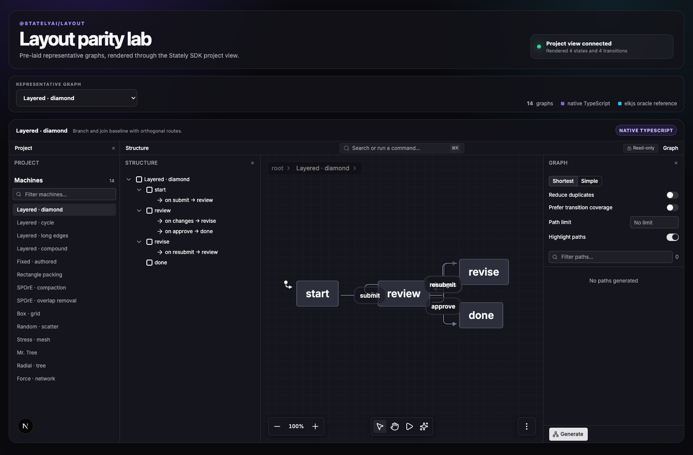

# @statelyai/layout

Native TypeScript graph layout algorithms built directly on
[`@statelyai/graph`](https://github.com/statelyai/graph).

This is not a new graph interchange format. Public APIs consume `Graph` and
return `VisualGraph`; positions remain node fields and routes remain
`GraphEdge.points`.

## Status

The native layered implementation currently supports flat graphs, cycles,
ports, self-loops, four directions, typed constraints, padding, orthogonal
routes, and replaceable phases. Native fixed, rectangle-packing, and initial
SPOrE implementations are also available. ELK Box SIMPLE placement and seeded
Random node placement are translated from Java. Partial, incremental,
route-only, and native compound layout remain explicit unimplemented
capabilities.

## Install

<!-- install command derived from package.json#name -->

```bash
pnpm add @statelyai/layout @statelyai/graph
```

## Quick start

<!-- primary layout functions exported from src/index.ts -->

```ts
import { createGraph } from "@statelyai/graph";
import { getLayeredLayout, getLayout } from "@statelyai/layout";

const graph = createGraph({
  nodes: [{ id: "a" }, { id: "b" }],
  edges: [{ id: "ab", sourceId: "a", targetId: "b" }],
});

const visualGraph = getLayeredLayout(graph, { direction: "right" });

const result = await getLayout({
  graph,
  algorithm: "layered",
  options: { direction: "right" },
});

result.graph;
result.patches;
result.diagnostics;
result.metrics;
```

## elkjs compatibility

<!-- elkjs-compatible entry point exported from package.json#exports -->

Legacy consumers can migrate through an isolated compatibility entry point:

```ts
import ELK from "@statelyai/layout/elkjs";

const elk = new ELK();
const legacyResult = await elk.layout(elkJsonGraph);
```

The adapter accepts ELK JSON and option aliases, translates to
`@statelyai/graph`, runs native algorithms, and translates the result back.
Native algorithms never consume ELK JSON directly.

## Parity lab

<!-- representative graph count and engines from demo/scenarios.ts -->

The browser lab sends 14 already-laid-out graphs through the
`@statelyai/sdk` project embed. It covers all 11 algorithm families exposed by
the elkjs 0.11.1 demonstrator surface plus cycle, long-edge, and compound
layered cases. Native and oracle-backed graphs are labeled separately; elkjs is
never bundled into the browser.

```bash
pnpm demo:generate
pnpm demo
```

The embed target defaults to `http://localhost:3000`. Override it with
`?editor=http://localhost:4864` when the Viz editor runs elsewhere.



## Extensibility

<!-- layered strategy fields from src/layered/types.ts -->

Layered phases are replaceable independently:

- `breakCycles`
- `assignLayers`
- `minimizeCrossings`
- `placeNodes`
- `routeEdges`

Strategies exchange typed artifacts keyed by graph entity IDs. They never
convert the public graph into an ELK-shaped API.

```ts
const result = getLayeredLayout(graph, {
  strategies: {
    routeEdges(input, orientation, placement) {
      return myRouter(input, orientation, placement);
    },
  },
});
```

See [Architecture](./docs/architecture.md), [Roadmap](./docs/roadmap.md), and
[Upstream and provenance](./docs/upstream.md). [Parity](./docs/parity.md) tracks
API coverage separately from native algorithm fidelity.

## Development

<!-- scripts derived from package.json#scripts -->

```bash
pnpm install
pnpm verify
pnpm bench
pnpm demo
```

`pnpm verify` checks Oxfmt, Oxlint, source and repository TypeScript projects,
generated corpus freshness, tests, declarations/runtime builds, the demo
bundle, and the packed package surface.
