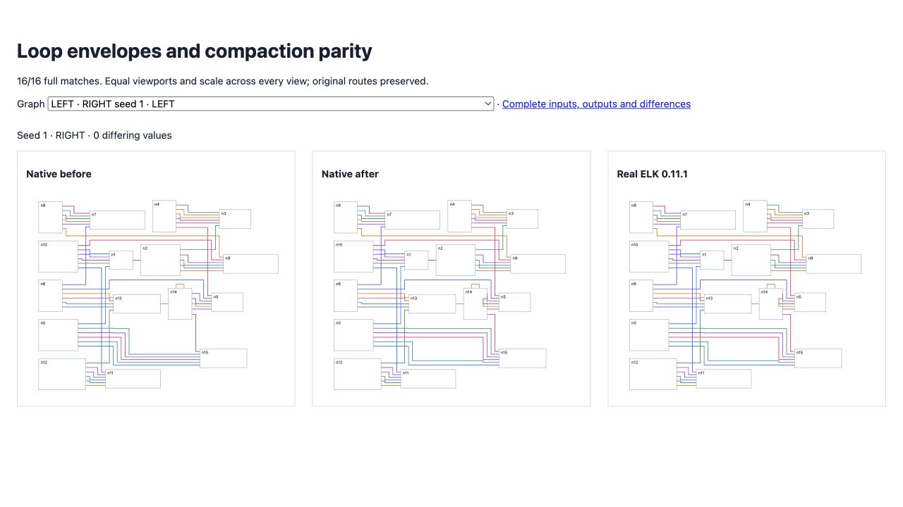

# Loop envelopes and compaction

<!-- implementation from src/layered/loop-envelopes.ts, src/layered/grouped-compaction.ts and src/layered/compaction-scanline.ts; results from validation.json -->

Fixed loop clearance is reserved before placement. Same-side loops use local perimeter routes, retaining ELK's repeated bends. Compaction hitboxes include self-loop envelopes and retain degenerate scanline intervals. Endpoint leads use the owner's margin border; skipped flow-face leads move with their adjacent corners. Synthetic LABEL terminals retain their initial flow order.

Compaction applies positions only after a complete finite solve. Infeasible visibility relations retain the initial layout/routes; unrelated programming errors still propagate. The oracle's six exceptions and fourteen non-finite layouts remain in the strict 200-case corpus. Native output stays finite; no comparison or assertion is relaxed.

Directional exact matches improve **122 → 132/200**, with zero native errors and no full matches lost. All 16 loop-compaction regressions match ELK (before 0/16). Fixed face pairs expand from 48 to 64 exact matches (16 newly failing regressions on the prior commit); 32 random validity cases retain finite orthogonal geometry. All 281 focused checks pass.

Full suite: **2,520 passed / 101 failed / 2,621**. Five old failures resolve; none are introduced. All eight email-drafter endpoint-placement cases pass. Original flat remains 32/100, with differences improving from 10,687 to 10,211. Hierarchy and original mixed loops remain 100/100. Broad parity remains incomplete.

[Full 200-case comparison](index.html) and [loop-compaction fixtures](fixtures/index.html) use identical inputs and scale. [Validation](validation.json) records complete gates and exact match deltas. Full reports, failing reference output, archived red tests, suite deltas and observed real ELK seed-8 phases remain here. `before-transactional-fix.json` preserves the intermediate native failures; `email-before-label-order.json` records the regressions resolved by label ordering.



```sh
pnpm exec vitest run test/oracle-compaction-self-loop-hitboxes.test.ts test/oracle-fixed-port-loop-pairs.test.ts test/compaction-infeasible-geometry.test.ts --maxWorkers 2 --exclude '.scratch/**'
pnpm exec tsx scripts/check-directional-compaction-parity.ts
```
