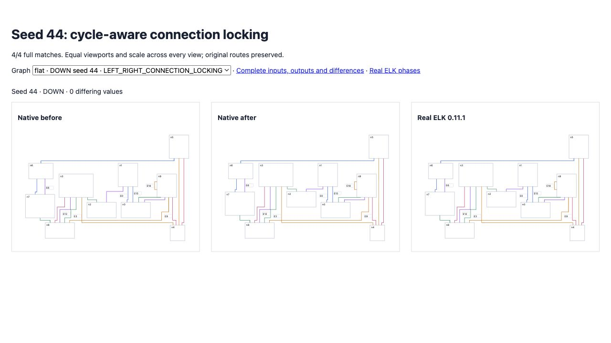

# Cycle-aware connection locking

Native connection-based compaction counted authored incoming/outgoing edges. ELK counts physical adjacency after cycle breaking. In seed 44, authored edge e2 leaves n2 but is physically reversed into n2; native treated that sink as a transit node and failed to lock its first-pass position. Downstream constraints then shifted n2, n3 and n7. Compaction now receives the retained orientation and counts physical endpoints.

Original directional matches remain **141/200**, differences **10,006 → 9,971**. Expanded seeds 26–50 improve **133 → 137/200**, differences **11,300 → 11,228**. Combined **278/400**, zero native errors, no complete matches lost or increased differing-value counts. Nine real ELK exceptions and non-finite reference output remain included and failing. Fresh seeds 51–75 retain **134/200** matches; differences improve **10,299 → 10,269**, with no lost complete matches or worsened rows. Combined observed coverage is **412/600** with 13 reference exceptions retained and failing. [Fresh evidence](fresh/index.html) saves the inputs, both source revisions and full outputs. Broad parity remains incomplete.

Seed 44 now matches complete geometry in all four directions with connection locking. Its vertical regressions now assert full geometry across all four compaction strategies, replacing the earlier explicitly scoped cross-axis checks. Eight horizontal strategy regressions extend coverage; the four connection-locking cases fail on the prior published source. All 24 seed-14/44 comparisons pass now. Tolerances and full random gate assertions are unchanged.

Full suite: **2,610 passed / 101 existing failed / 2,711 total**; no existing failures changed. Source/repository types, selected lint/format and build pass. The separate original flat gate remains **38/100**, 8,994 differences, zero errors.

[Before/current/ELK](fixtures/index.html) uses identical inputs and equal scale. [Original corpus](index.html), [expanded corpus](expanded/index.html) and [all changed rows](delta.json) preserve the evidence. Previous seed-34 UP differences remain unchanged and recorded; this fix introduces no additional regressions in the observed corpus.

```sh
pnpm exec vitest run test/oracle-smart-vertical-labels.test.ts --maxWorkers=2 --exclude '.scratch/**'
pnpm exec tsx scripts/check-directional-compaction-parity.ts
pnpm exec tsx scripts/check-directional-compaction-parity.ts .scratch/directional-26-50.json 26 50
```


