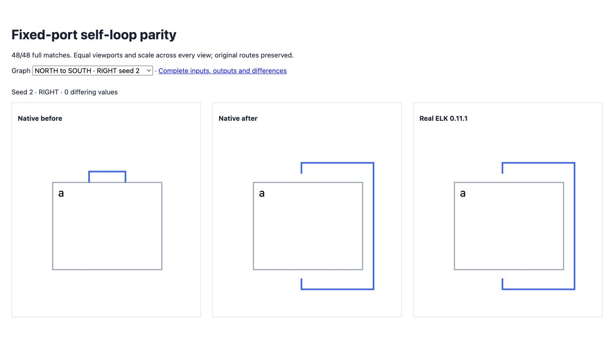

# Fixed-port self-loop routing

<!-- fixed-port loop behavior from src/layered/strategies.ts and src/layered/fixed-self-loop.ts; measured results from validation.json -->

Fixed loops between different physical faces now enter the perimeter router before feedback routing. Clearance starts outside the port anchor, including nonzero port dimensions. North reservations follow actual fixed faces; opposite cross-axis faces retain ELK's perimeter direction.

All 48 distinct face-pair/direction regressions match complete real ELK geometry (previous 0/48). Existing loop regression coverage also passes: 189 focused assertions in total. Full suite: 2,451 passed, 106 failed; no existing failure added or resolved.

The 200-case directional corpus remains 122/200, with no lost full match or native error; six real ELK errors remain included. Its difference count changes from 11,887 to 11,884. Original flat remains 32/100, with differences increasing from 10,614 to 10,687; hierarchy and original mixed loops remain 100/100. These results establish the isolated loop correction, not broad parity.

[Before/native/ELK diagrams](fixtures/index.html) use identical inputs and equal scale. [Validation](validation.json) records all gates; full input/output reports, errors and suite deltas remain here. The larger degenerate-hitbox compaction candidate remains unshipped because it introduces native errors.



```sh
pnpm exec vitest run test/oracle-fixed-port-loop-pairs.test.ts --maxWorkers 2 --exclude '.scratch/**'
pnpm exec tsx scripts/check-directional-compaction-parity.ts
```
