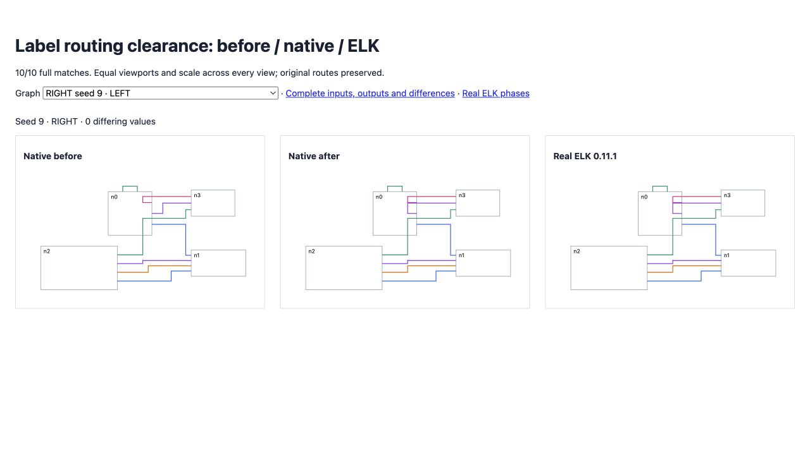

# Label routing clearance

<!-- routing implementation from src/layered/strategies.ts; regression coverage from test/oracle-label-routing-clearance.test.ts; results from validation.json -->

Orthogonal routing previously omitted the final terminal clearance beside LABEL layers. The last track could land directly on the temporary label boundary, leaving no independently compactable bend pair. Routing now reserves both terminal clearances, matching real ELK's track spacing.

All ten seed-9 direction/strategy regressions match complete ELK geometry (before 0/10). The [before/current/ELK view](fixtures/index.html) preserves identical inputs, dimensions, viewport and scale. [Observed real ELK phases](real-elk-phases.json) preserve the initial routing bends and LABEL positions. The native change is one spacing correction; production stays native.

The original directional gate improves **132 → 134/200**, with zero native errors and no exact matches lost. Original flat improves **32 → 34/100**, with differences improving **10,211 → 9,777**. Hierarchical directional cases remain 100/100.

Seeds 26–50 add [200 further comparisons](expanded/index.html), with **132/200** exact matches and zero native errors. Differences improve 12,419 → 12,394; no full matches are lost. Combined directional coverage is **266/400**, retaining all failed inputs and nine real ELK exceptions. Non-finite reference output remains in reports. Broad parity remains incomplete.

All 122 focused checks pass. Full suite: **2,530 passed / 101 failed / 2,631**, with no existing failure introduced or resolved. Source/repository types, selected lint/format and package build pass. The [original comparison](index.html), full reports, archived red regressions and suite deltas remain here. No assertion or tolerance is relaxed.



<!-- inclusive seed-range command from scripts/check-directional-compaction-parity.ts -->

```sh
pnpm exec vitest run test/oracle-label-routing-clearance.test.ts --maxWorkers 2 --exclude '.scratch/**'
pnpm exec tsx scripts/check-directional-compaction-parity.ts .scratch/directional-26-50.json 26 50
```
