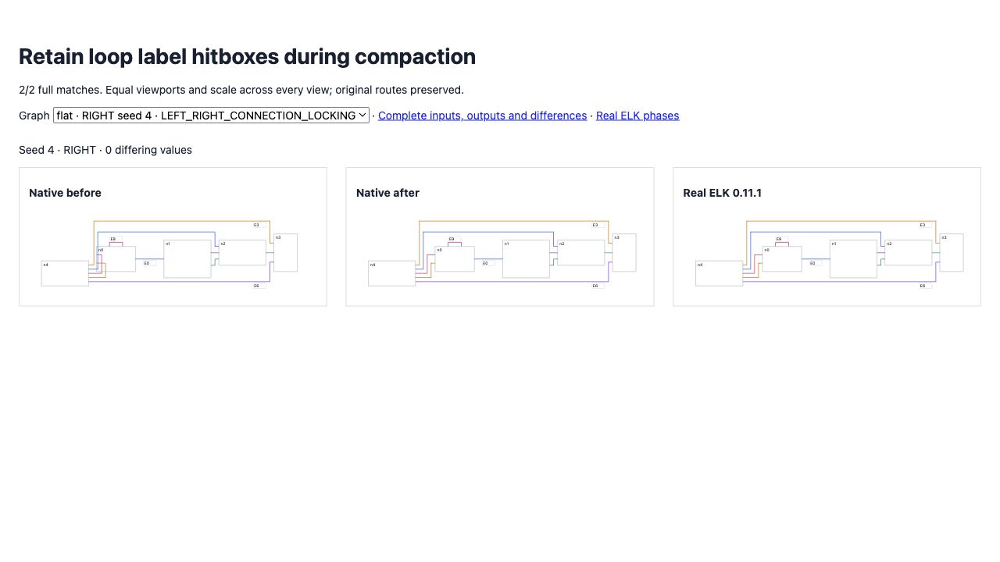

# Retain loop labels during compaction

<!-- implementation from src/layered/grouped-compaction.ts and src/layered/loop-envelopes.ts; regression coverage from test/oracle-loop-label-compaction.test.ts; results from validation.json -->

Seed 4 matched ELK before compaction, but native compaction pulled four nodes 30 pixels left. Placement reserved the exterior loop label; compaction reconstructed the owner hitbox from route bends and lost its label extent. The native owner height was 74, while real ELK retained 90. Compaction now combines the complete loop envelope with port margins before measuring bends and calculating visibility constraints.

All **eight new full-geometry regressions** fail on revision `9e6b762` and pass now: RIGHT/LEFT with all four directional compaction strategies. A separate exploratory check confirms seed 4 matches in all four directions and four strategies. Assertions and tolerances remain unchanged.

Original directional matches improve **137 → 139/200**, differences **10,153 → 10,096**. Expanded seeds 26–50 remain **133/200**, differences **11,399 → 11,455**. Combined **272/400**, zero native errors, no complete matches lost. Original flat remains **36/100**, 9,084 differences. Real ELK exceptions and non-finite outputs remain included and failing. Broad parity remains incomplete.

The expanded count increases because seed 44 DOWN/UP becomes worse: 60 → 121 and 60 → 75 differences. Its BK placement already omits 34 pixels of cross-axis separation relative to ELK; the corrected hitbox changes compaction visibility on that incorrect placement. Those cases, the native candidate coordinates and real ELK phases are preserved as the next diagnosis target. No assertions were removed to hide them.

Focused selection: **62 passed**. Full suite: **2,586 passed / 101 existing failed / 2,687 total**; no existing failure introduced or resolved. Source/repository types, selected lint/format and package build pass.

[Before/current/ELK proof](fixtures/index.html) uses identical inputs and equal viewports/scale, with label boxes visible. [Original corpus](index.html), [expanded corpus](expanded/index.html), archived red regressions, initial native compaction geometry and real ELK phase observations preserve evidence.



```sh
pnpm exec vitest run test/oracle-loop-label-compaction.test.ts test/oracle-movable-loop-labels.test.ts test/oracle-compaction-self-loop-hitboxes.test.ts --maxWorkers 2 --exclude '.scratch/**'
pnpm exec tsx scripts/check-directional-compaction-parity.ts
pnpm exec tsx scripts/check-directional-compaction-parity.ts .scratch/directional-26-50.json 26 50
node scripts/parity/trace-bk-worker.mjs .scratch/directional-26-50.json .scratch/seed44-bk.json 68
```
