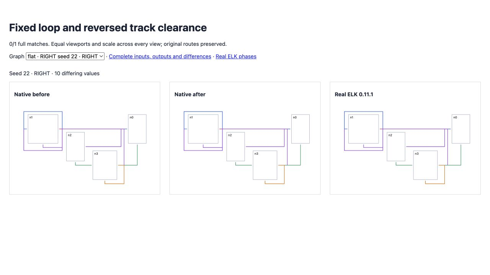

# Loop track clearance

<!-- implementation from src/layered/strategies.ts and src/layered/grouped-compaction.ts; coverage from test/oracle-shared-cross-port-row.test.ts; results from validation.json -->

Routing ranks included protruding ports but omitted fixed self-loop flow envelopes. In random flat seed 22 RIGHT, an unrelated track therefore landed on the loop's outer track, merging them during compaction. Routing now includes the prepared loop envelope.

Track endpoint clearance also used authored direction and the last vertical segment's start. Real ELK uses cycle-broken physical direction and the penultimate bend, including trailing horizontal bends. Using the wrong point suppressed spacing and allowed unrelated tracks to touch the loop.

Four regression cases compare all node positions, graph dimensions and complete route sections against real ELK under LEFT, RIGHT and both locking strategies. All four fail on the published baseline and pass after correction. The original five cross-axis tests still pass. Junction metadata remains different: seed 22 has **10** strict differences, down from **31**. No assertion or tolerance is relaxed.

Original directional coverage remains **134/200**, with differences improving **10,594 → 10,515**. Expanded seeds 26–50 remain **132/200**, with differences improving **12,392 → 11,892**. No complete matches are lost. Native errors remain zero; real ELK exceptions and non-finite output remain preserved. Combined strict coverage remains **266/400**. Original flat remains **34/100**, with differences improving **9,767 → 9,471** and no complete matches lost. Broad parity remains incomplete.

[Matched-scale before/current/ELK proof](fixtures/index.html), [original corpus](index.html), [expanded corpus](expanded/index.html) and [real ELK compaction sweeps](worker-phases.json) preserve inputs and outputs. The sweep trace confirms ELK uses end-before-start tie ordering; the correction changes rank envelopes and clearance flags, not event ordering.

Full suite: **2,539 passed / 101 failed / 2,640**. The four new regressions pass; no existing failure is introduced or resolved. Source/repository types, selected lint/format and package build pass.



```sh
pnpm exec vitest run test/oracle-shared-cross-port-row.test.ts --maxWorkers 2 --exclude '.scratch/**'
pnpm exec tsx scripts/check-directional-compaction-parity.ts
pnpm exec tsx scripts/check-directional-compaction-parity.ts .scratch/directional-26-50.json 26 50
```
