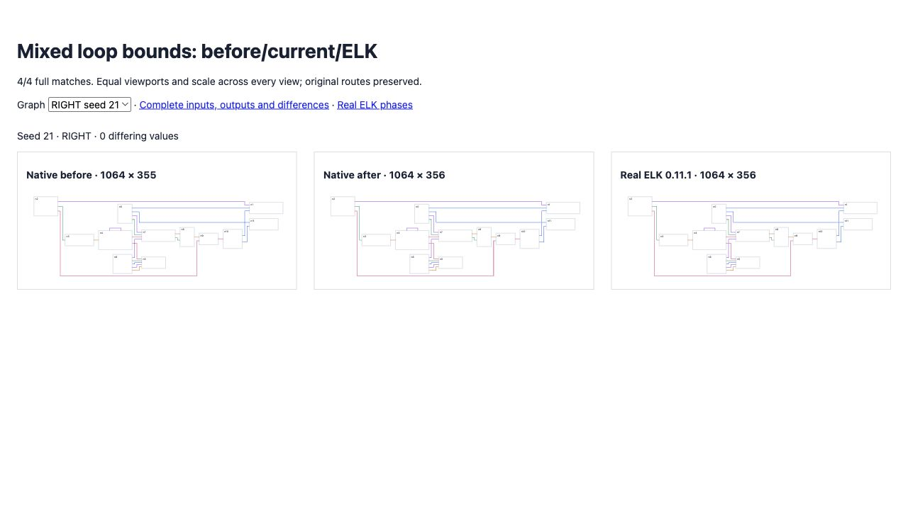

# Mixed self-loop and long-edge bounds

Native normalization suppressed the edge boundary allowance whenever any self-loop existed. Real ELK still includes long-edge dummy cross-axis thickness: seed 21's routing phase reports height 332 before padding, while the final ordinary edge centerline ends at 331. Native incorrectly reported 331 because an unrelated loop disabled the allowance.

Normalization now applies the allowance to ordinary route extents before unioning loop envelopes, nodes and labels. Loops retain their own measured envelope, and the allowance no longer inflates a larger label box. An exploratory blanket allowance introduced 176 suite regressions; that approach was rejected and its output is retained separately.

The original default flat gate improves **38 → 42/100**, differences **8,994 → 8,988**, zero errors, no lost complete matches or worsened rows. Four new regressions assert complete geometry for seed 21 RIGHT/LEFT and seed 4 DOWN/UP; all fail before and pass after.

All 600 directional compaction comparisons were rerun and are byte-identical to the retained prior evidence: **412/600**, zero native errors, 13 reference exceptions retained/failing, with non-finite reference output also failing. [Validation manifest](validation.json) records summaries, retained paths and hashes. Broad parity remains incomplete.

Full suite: **2,614 passed / 101 existing failed / 2,715 total**, no existing failures changed. Source/repository types, selected lint/format and build pass.

[Before/current/ELK](fixtures/index.html), [100-case flat corpus](index.html), [changed rows](delta.json), and [real ELK phases](worker-phases.json) preserve evidence.

```sh
pnpm exec vitest run test/oracle-loop-mixed-bounds.test.ts --maxWorkers=2 --exclude '.scratch/**'
pnpm exec tsx scripts/check-flat-parity.ts
```


