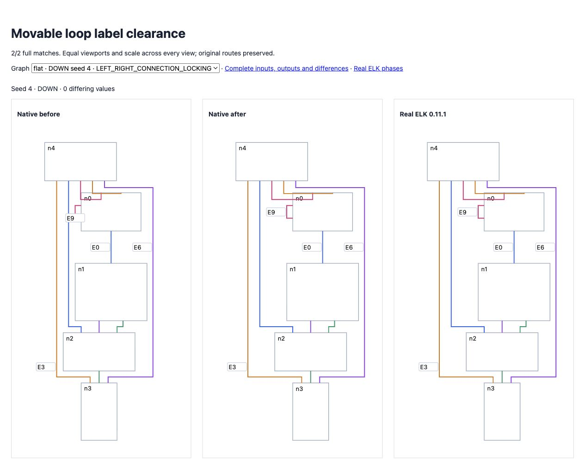

# Movable self-loop label clearance

<!-- implementation from src/layered/loop-envelopes.ts, src/layered/strategies.ts, src/layered/index.ts and src/elkjs/index.ts; coverage from test/oracle-movable-loop-labels.test.ts; results from validation.json -->

Native placement reserved the loop line but omitted its exterior label. In random seed 4 DOWN/UP, that omitted 34 pixels of cross-axis clearance, shifted four nodes, and reduced the graph width. Native labels also used the generic edge midpoint, ignoring the loop side and directional transform. Stacked loop routes did not include preceding exterior labels. Bounds added an unrelated center-label pixel to self-loops.

Native routing now reserves directional exterior label extents before BK placement, carries preceding label clearance into stacked tracks, and aligns labels using physical loop sides. Cross-axis labels center on the node; flow-side labels align with the first physical port. Bounds exclude the generic center-label pixel for self-loops. These calculations remain native; real ELK is the oracle.

All **38 new full-geometry regressions** fail on revision `3f30668` and pass now. Coverage includes both random seed-4 directions and 36 isolated labeled-loop combinations: four directions, three side distributions and one/two/four stacked loops. Existing assertions and tolerances remain unchanged. Other loop orderings, mixed fixed ports and broader label options remain parity work.

Original directional full matches improve **135 → 137/200**, differences **10,309 → 10,153**. Expanded seeds 26–50 remain **133/200**, differences **11,664 → 11,399**. Combined **270/400**, zero native errors, no lost complete matches. Real ELK exceptions and non-finite reference outputs remain included and failing. Original flat improves **34 → 36/100**, differences **9,238 → 9,084**.

Focused checks: **99 passed**. Full suite: **2,578 passed / 101 existing failed / 2,679 total**, no existing failures introduced or resolved. Source/repository types, selected lint/format and package build pass. Broad parity remains incomplete.

[Before/current/ELK proof](fixtures/index.html) preserves identical inputs and equal viewports/scale. Edge label boxes are visible. [Original corpus](index.html), [expanded corpus](expanded/index.html), isolated cases, archived red regressions, worker observations and full-suite deltas preserve evidence.



```sh
pnpm exec vitest run test/oracle-movable-loop-labels.test.ts test/oracle-loop-envelopes.test.ts test/oracle-self-loop-options.test.ts test/oracle-shared-cross-port-row.test.ts --maxWorkers 2 --exclude '.scratch/**'
pnpm exec tsx scripts/check-directional-compaction-parity.ts
pnpm exec tsx scripts/check-directional-compaction-parity.ts .scratch/directional-26-50.json 26 50
pnpm test:parity:flat
```
