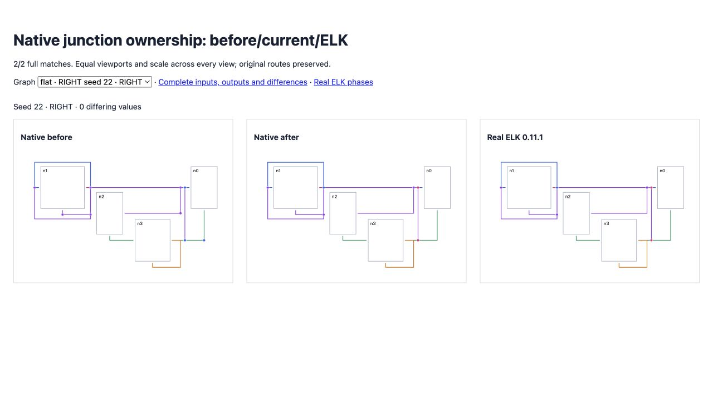
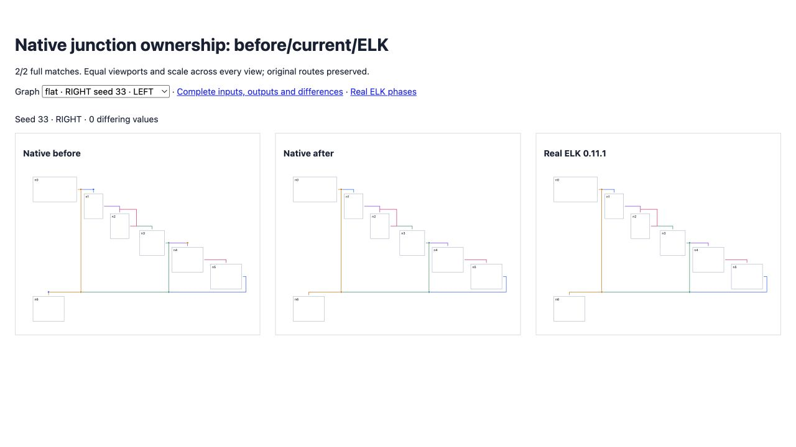

# Native junction generation

<!-- implementation from src/layered/orthogonal-junctions.ts, src/layered/strategies.ts, src/layered/long-edges.ts, src/layered/grouped-compaction.ts and src/internal/elkjs-compatibility.ts; regression coverage from test/oracle-shared-cross-port-row.test.ts; results from validation.json -->

The adapter previously reconstructed branches from final routes. Port restoration and long-edge joining distort those spans and ownership: seed 22 assigned shared branches to a reversed edge and inferred branches at auxiliary port bends.

Native routing now emits junctions using physical hypersegment port coordinates and outgoing-edge append order. Same-layer inverted-port links participate at their physical layer boundaries. Fixed-order ports use actual anchors rather than synthesized edge-distribution coordinates. Junctions follow merged track movement during compaction, retain their original owning edge through long-edge joining, and reach the adapter through typed internal metadata. The adapter preserves that metadata and applies bounds normalization to junctions.

Four seed-22 strategy regressions now assert complete geometry, including ports, labels and junction ownership, while retaining their existing section and node checks. Seed 33 RIGHT adds another full-geometry regression. All five fail on the published baseline and pass now. All 200 shared-port random tests and 16 cross-side fan-out tests pass. Assertions and tolerances remain unchanged.

Original directional matches improve **134 → 135/200**, with differences **10,515 → 10,309**. Expanded seeds 26–50 improve **132 → 133/200**, with differences **11,892 → 11,664**. Combined coverage is **268/400**; no complete matches are lost, and native errors remain zero. Reference exceptions and non-finite output remain included and failing. Original flat remains **34/100**, with differences **9,471 → 9,238** and no complete matches lost. Broad parity remains incomplete.

Full suite: **2,540 passed / 101 failed / 2,641**. No existing failure is introduced or resolved. Source/repository types, selected lint/format and package build pass.

[Before/current/ELK proof](fixtures/index.html) shows both newly matching random graphs at identical dimensions, viewport and scale. Colored dots identify junction owners. [Original corpus](index.html), [expanded corpus](expanded/index.html), archived red regressions and full-suite evidence preserve failures. [Real ELK observations](worker-phases.json) record junction emission before joining and compaction; the observer does not replace worker algorithms.





```sh
pnpm exec vitest run test/oracle-shared-cross-port-row.test.ts test/oracle-shared-port-random.test.ts test/oracle-cross-side-fanout.test.ts --maxWorkers 2 --exclude '.scratch/**'
pnpm exec tsx scripts/check-directional-compaction-parity.ts
pnpm exec tsx scripts/check-directional-compaction-parity.ts .scratch/directional-26-50.json 26 50
node scripts/parity/trace-junction-worker.mjs docs/heuristics/native-junctions/report.json .scratch/junction-worker.json 21
```
