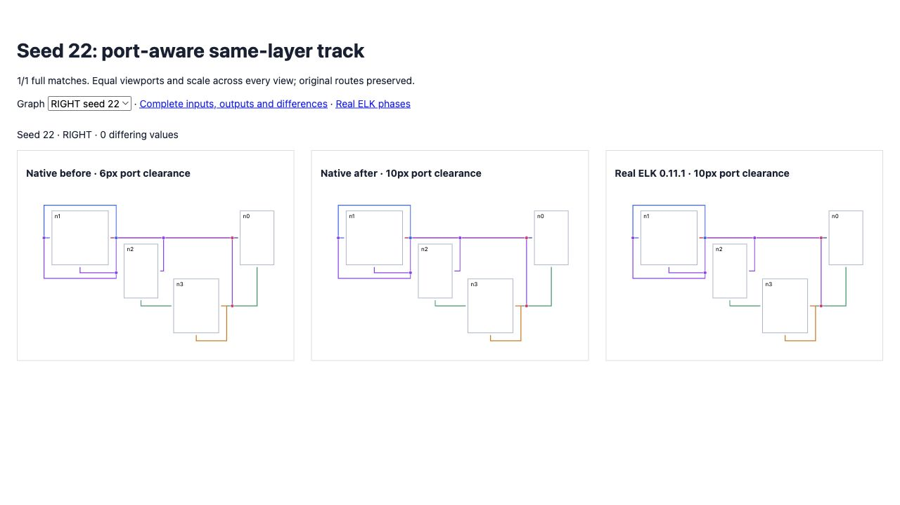

# Port-aware same-layer tracks

The same-layer routing fallback measured only its endpoint node bodies, bypassing the occupied layer envelope already computed from ports and routing reservations. Seed 22 RIGHT placed a shared track at x224, six pixels beyond its east port at x218; real ELK placed it at x228, preserving ten pixels of clearance. The fallback now uses the occupied envelope. Joined routes and junctions retain that corrected physical track.

Default flat exact matches improve **42 → 43/100**, differing values **8,988 → 8,957**, zero errors, no lost complete matches. Four complete-geometry regressions cover port widths 2, 4, 8 and 12; all fail before and pass after.

Directional matches remain **412/600**: original **141/200**, expanded **137/200**, fresh **134/200**. Differing values improve **9,971 → 9,938**, **11,228 → 11,223**, and **10,269 → 10,265** respectively. Zero native errors, no complete matches lost. Thirteen ELK exceptions and non-finite reference layouts remain included and failing.

Two incomplete compaction cases worsen: original seed 17 RIGHT **116 → 133** differences, and seed 2 LEFT **248 → 322**. Native compaction reports no infeasibility for either case; these are changed solved geometry, not a failed-solve fallback. Complete before/after inputs and outputs remain preserved. Their earlier placement and constraint differences need further diagnosis. Real ELK compaction graphs for both cases and the native before/after solve rectangles are retained for that comparison. Broad parity remains incomplete.

Full suite: **2,618 passed / 101 existing failed / 2,719 total**, no existing failures changed. Source/repository types, selected lint/format and build pass.

[Before/current/ELK](fixtures/index.html), [original corpus](index.html), [expanded corpus](expanded/index.html), [fresh corpus](fresh/index.html), [default flat report](flat-report.json), and [all changed rows](delta.json) preserve evidence.

```sh
pnpm exec vitest run test/oracle-port-aware-same-layer-track.test.ts --maxWorkers=2 --exclude '.scratch/**'
pnpm exec tsx scripts/check-flat-parity.ts
pnpm exec tsx scripts/check-directional-compaction-parity.ts
pnpm exec tsx scripts/check-directional-compaction-parity.ts .scratch/directional-26-50.json 26 50
pnpm exec tsx scripts/check-directional-compaction-parity.ts .scratch/directional-51-75.json 51 75
```


