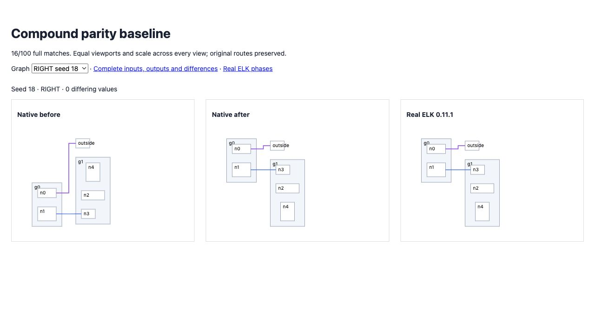
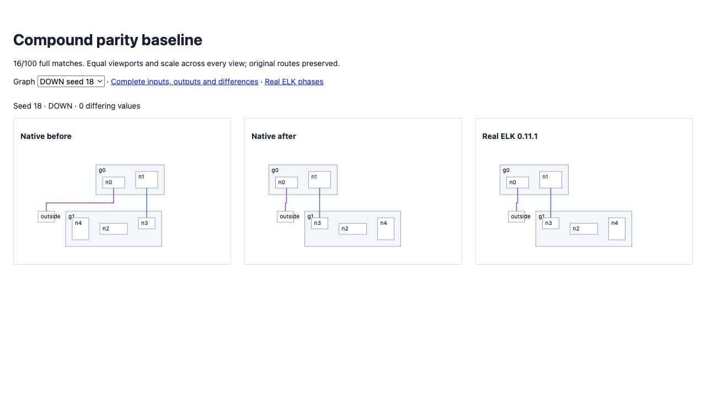

# Scope crossing order

Uncommitted; parity incomplete. The unchanged 100-case hierarchy gate improves
from **12 to 16 exact matches**, with no lost matches or engine errors. Differing
values fall from **3,665 to 3,354**; tolerance remains 5e-13. Seed 18 now matches
complete geometry and route containers in all four directions. Its four new
regressions fail before the phase fix and pass afterward.

Native code reapplied FIRST/LAST ordering after crossing minimization, overriding
the selected sweep order. It now prepares that ordering before the sweep. The
existing merged-edge dummy policy remains separate. A resumable internal scope
pipeline preserves default execution while allowing a coordinator to supply an
order before placement/routing. Six scope tests pass. The adapter still completes
children independently; coupled hierarchy sweeps remain incomplete.

Final full suite: **1,902 pass / 118 fail / 2,020**. No new failure names relative
to the preceding uncommitted snapshot. Earlier introduced hierarchy/label
failures remain; source stays uncommitted/unpushed. Source/repository types,
selected format/lint and build pass. Main was fetched and remains the branch's
fork point. No clean-snapshot or remote CI claim.

Real ELK observation confirms a parent sweep enters the child sweep before the
parent completes. Instrumented output was compared with uninstrumented real ELK
and is identical. This is evidence for the next coordinator implementation,
not a claim that native coordination is complete.

[Before/after/real ELK gallery](./index.html), [current replay](./report.json),
[previous replay](./before.json), [failure delta](./full-suite-delta.json),
[worker observations](./worker-phases.json), [manifest](./manifest.json),
[source and validation archive](./source-and-validation.tar.gz).
RIGHT and DOWN seed 18 were browser-verified; every view shares identical input,
scale and viewport. Original routes are preserved.

