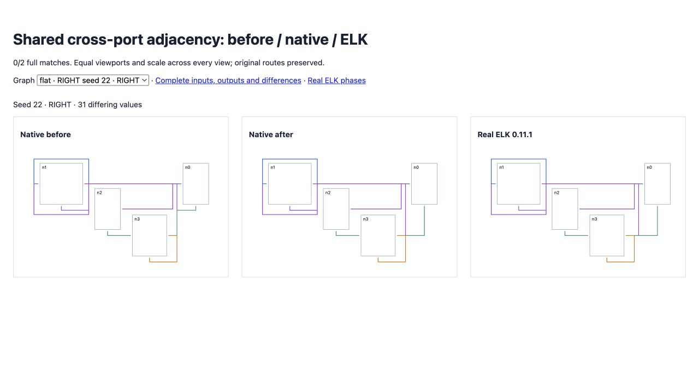

# Shared cross-port adjacency

<!-- implementation from src/layered/long-edges.ts, src/layered/inverted-ports.ts, src/layered/north-south-ports.ts and src/layered/bk-node-placement.ts; coverage from test/oracle-shared-cross-port-row.test.ts; results from validation.json -->

BK straightening previously selected edges in model order on detached cross-port dummies. Real ELK retains physical incoming adjacency: cycle reversal appends reversed edges, long-edge splitting appends terminal continuations, and source-port inversion appends its continuation. The native phases now retain those orders and carry their metadata through label preparation.

For flat seed 22 RIGHT, native routing previously placed the shared south-port row at y=132; ELK selected y=191 through a different incoming edge. The corrected row matches under all five compaction strategies. The five regression assertions compare complete cross-axis point sequences for all four affected edges; all five fail before and pass after. Full flow-coordinate parity remains enforced by the strict random gate, which still fails for this graph.

[Before/current/ELK diagrams](fixtures/index.html) retain identical inputs, dimensions, scale and viewport. [Real ELK observations](worker-phases.json) include BK edge picks and the physical incoming lists. The [mirrored trace](left-worker-phases.json) preserves LEFT inversion behavior.

Original directional matches remain **134/200**, with differences improving **10,602 → 10,594**. Expanded seeds 26–50 remain **132/200**, with differences improving **12,394 → 12,392**. No full matches are lost; native errors remain zero. Combined strict coverage remains **266/400**. Original flat remains 34/100, with differences improving 9,777 → 9,767. Real ELK exceptions and non-finite output remain preserved. Broad parity remains incomplete.

Full suite: **2,535 passed / 101 failed / 2,636**; no existing failure introduced or resolved. Source/repository types, selected lint/format and package build pass.

[Original comparison](index.html), [expanded comparison](expanded/index.html), failing inputs, regression results and full-suite evidence remain here. No assertion or tolerance is relaxed.



```sh
pnpm exec vitest run test/oracle-shared-cross-port-row.test.ts --maxWorkers 2 --exclude '.scratch/**'
pnpm exec tsx scripts/check-directional-compaction-parity.ts
pnpm exec tsx scripts/check-directional-compaction-parity.ts .scratch/directional-26-50.json 26 50
```
