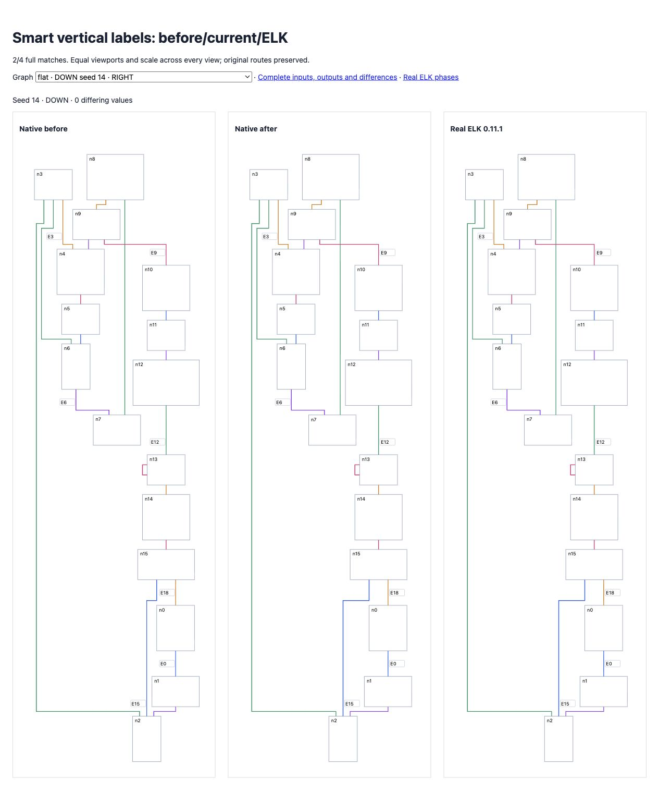
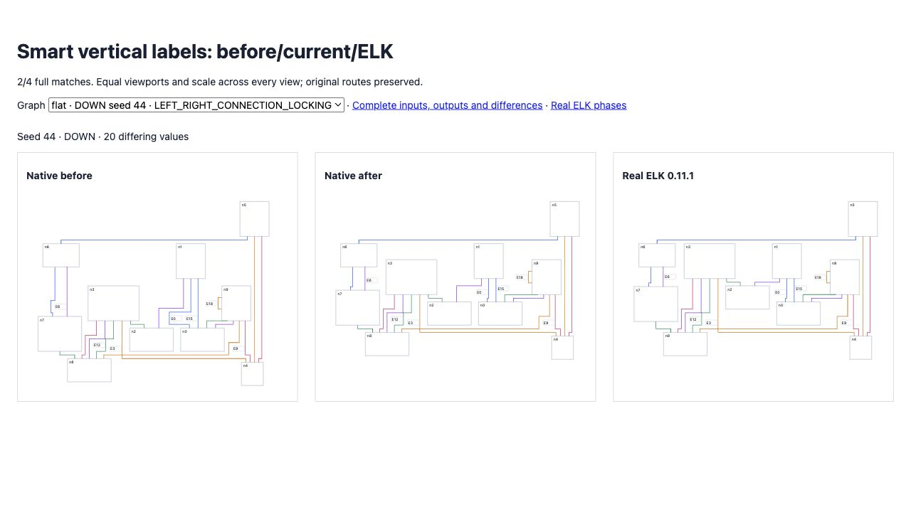

# Smart vertical label sides

ELK transposes the default side-selection option before vertical layout, then makes smart dummy-run choices in canonical coordinates. Native Stately transposed those choices again when assigning label ports. This inverted smart label anchors while leaving default choices correct. The fix selects sides in canonical coordinates and converts only the restoration metadata back to the original direction.

Original directional random matches improve **139 → 141/200**, differences **10,096 → 10,006**. Expanded seeds 26–50 remain **133/200**, differences **11,455 → 11,300**. Combined **274/400**, zero native errors, no complete matches lost. The separate original flat gate improves **36 → 38/100**, differences **9,084 → 8,994**, with no lost complete matches. Nine reference exceptions remain failing. Strict tolerances unchanged.

Seed 14 DOWN/UP now matches complete geometry. Seed 44 DOWN/UP cross-axis geometry matches across all four compaction strategies, but each retains **20 full-geometry differences** in flow-axis compaction. Expanded seed 34 UP increases from 99 to 104 differences; the full failing input and both layouts remain preserved. This is progress, not broad parity.

All **16 new regressions** fail before and pass after: eight complete seed-14 comparisons and eight explicitly scoped seed-44 cross-axis comparisons. Full suite: **2,602 passed / 101 existing failed / 2,703 total**; no existing failures changed. Source/repository types, selected lint/format and build pass.

[Before/current/ELK](fixtures/index.html) uses identical inputs and equal scales. [Original corpus](index.html), [expanded corpus](expanded/index.html), and [all changed rows](delta.json) retain the evidence.

```sh
pnpm exec vitest run test/oracle-smart-vertical-labels.test.ts --maxWorkers=2 --exclude '.scratch/**'
pnpm exec tsx scripts/check-directional-compaction-parity.ts
pnpm exec tsx scripts/check-directional-compaction-parity.ts .scratch/directional-26-50.json 26 50
```




