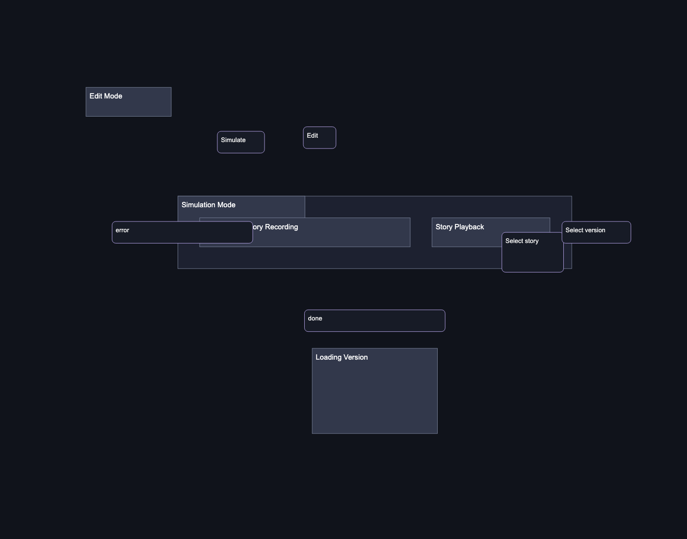
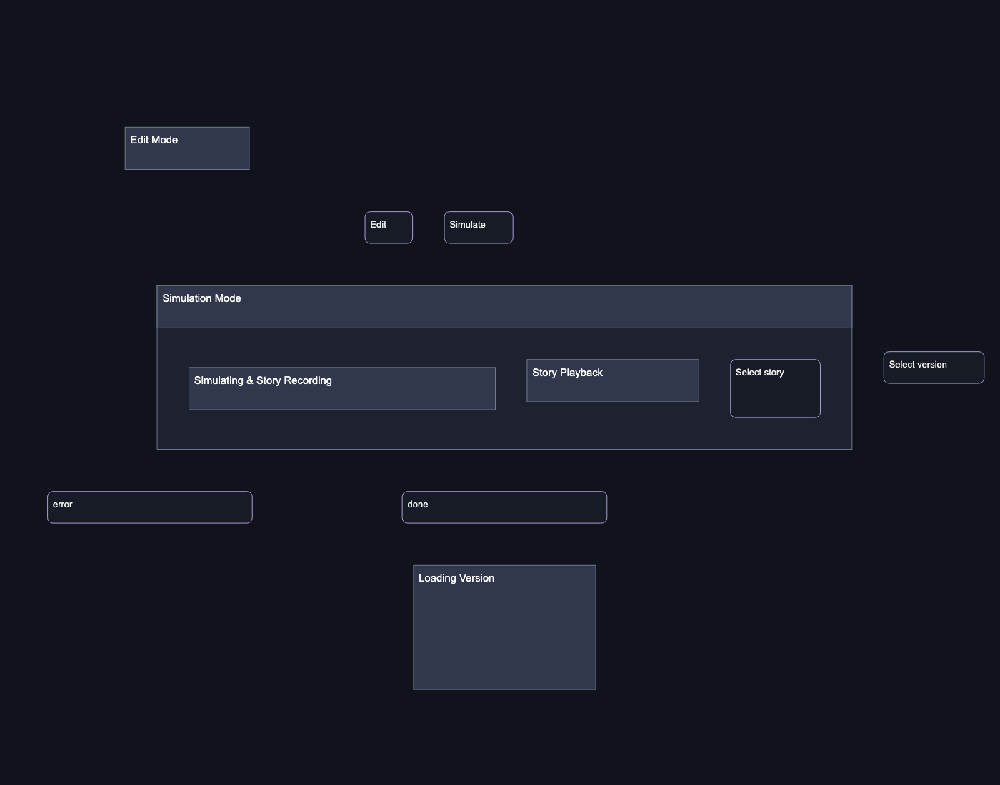
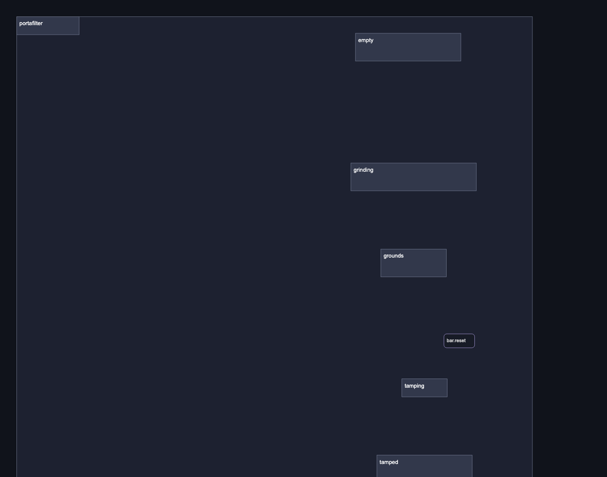
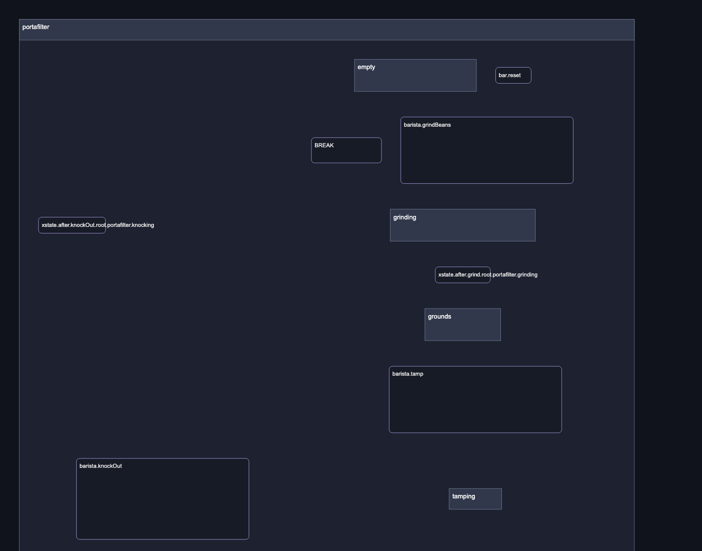

# Native compound geometry proof

Before uses published `@statelyai/layout` 0.2.0 through `getLayeredLayout`.
After uses this branch's native compound pipeline. Neither image applies
consumer repairs. Inputs are the measured editor and espresso fixtures in
`test/fixtures/*-native.json`; both runs use down direction, 48 padding,
48 node spacing, 64 layer spacing, and model-order cycle breaking. Dimensions
are identical between runs; the new header option is ignored by 0.2.0.

The renderer shows occupied node/header and label rectangles, without routes.
Each pair uses the same 1400 × 1100 viewport and scale. Editor images share a
viewBox containing both outputs. Espresso images show the same 1750 × 1375
crop from the portafilter compound's top-left; geometry outside that crop is
covered by the full-fixture tests. Node positions and sizes change between runs.

| Fixture              | Before                             | After                            |
| -------------------- | ---------------------------------- | -------------------------------- |
| Editor modes         |  |  |
| Espresso portafilter |      |      |

Regenerate after `pnpm build`:

```sh
node scripts/render-native-compound-proof.mjs /absolute/path/to/published-layout/dist/index.mjs /absolute/path/to/playwright/index.mjs
```

Playwright is supplied by the consumer's browser test environment; it is not a
Layout runtime dependency. Native fixture tests cover all four directions,
full sibling bounds, measured labels, header avoidance, and immutable input.
