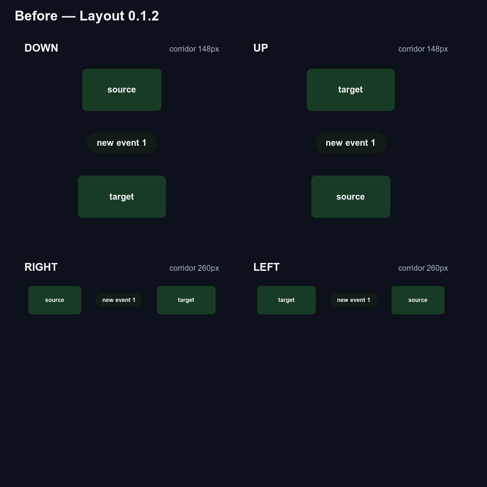
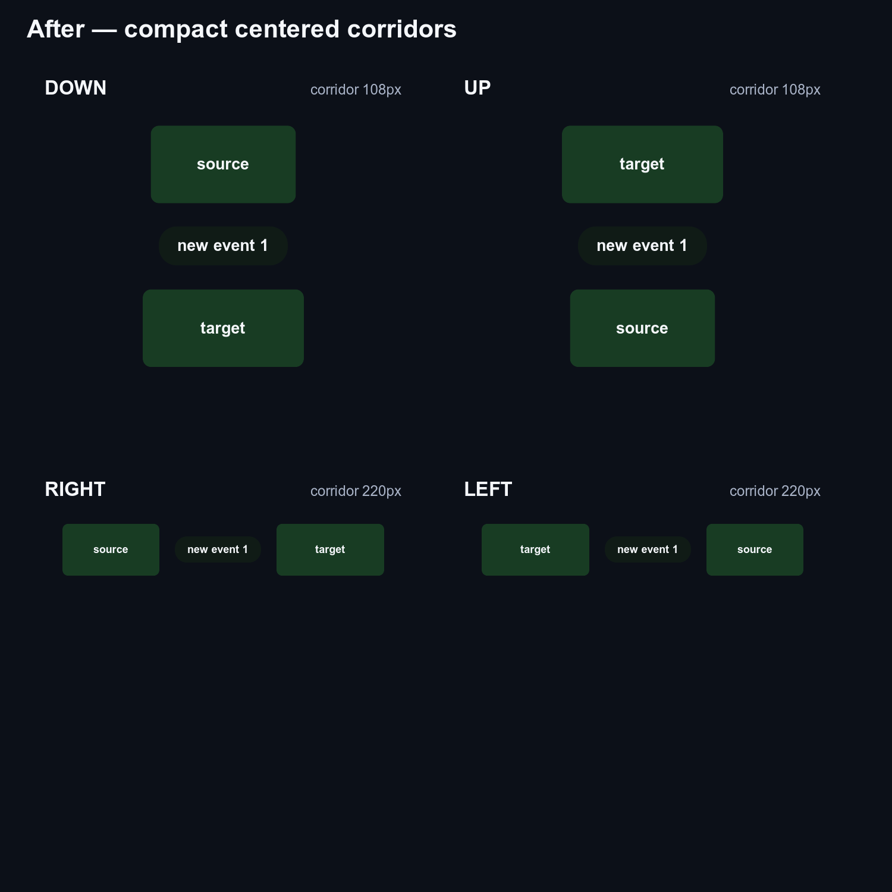

# Compact center-label corridor proof

Both images render the same graph in `DOWN`, `UP`, `RIGHT`, and `LEFT` directions
with identical node, port, and label dimensions, scale, and viewport. The proof
generator rejects label/node intersections, labels outside their endpoint
corridor, and non-orthogonal edge sections.

| Before (`@statelyai/layout` 0.1.2)                        | After (this change)                                   |
| --------------------------------------------------------- | ----------------------------------------------------- |
|  |  |

Build the base revision and current revision, then generate the SVG sources and
convert them without resizing:

```sh
pnpm exec tsx scripts/render-compact-label-spacing-proof.ts \
  --before /path/to/layout-0.1.2/dist/elkjs/index.mjs \
  --after "$PWD/dist/elkjs/index.mjs" \
  --output "$PWD/docs/proofs/compact-center-label-spacing"
magick -background '#0c1018' -density 144 \
  docs/proofs/compact-center-label-spacing/before.svg -depth 8 \
  docs/proofs/compact-center-label-spacing/before.png
magick -background '#0c1018' -density 144 \
  docs/proofs/compact-center-label-spacing/after.svg -depth 8 \
  docs/proofs/compact-center-label-spacing/after.png
```
