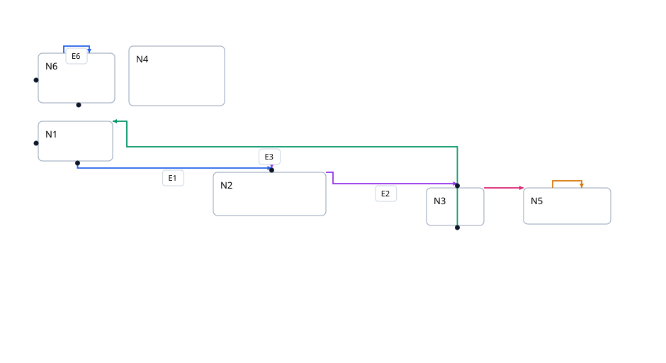
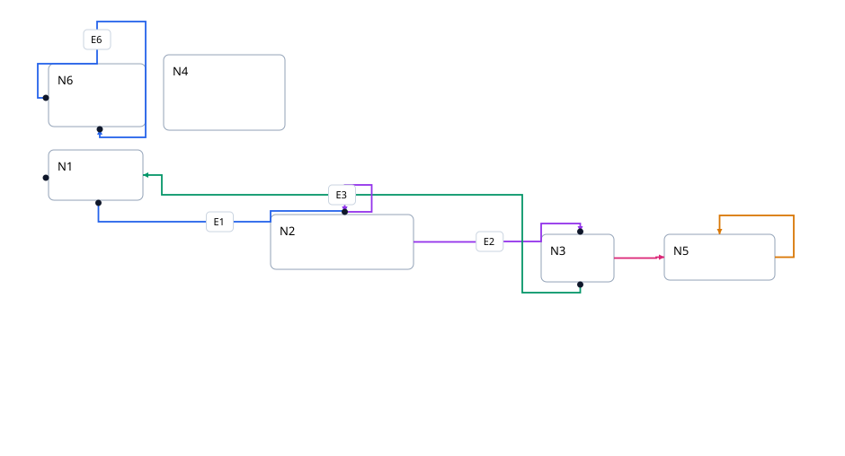
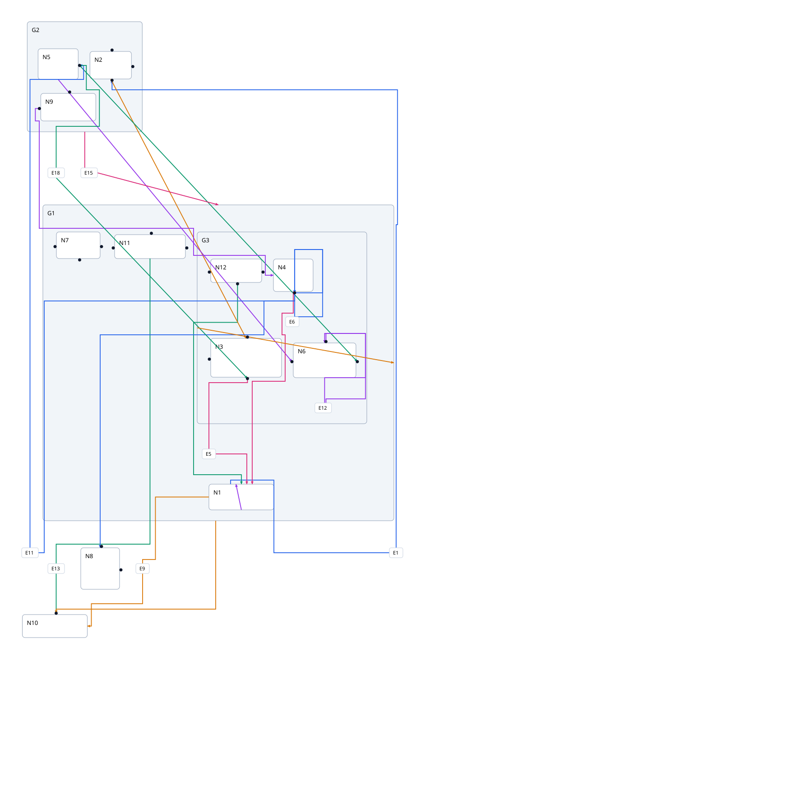
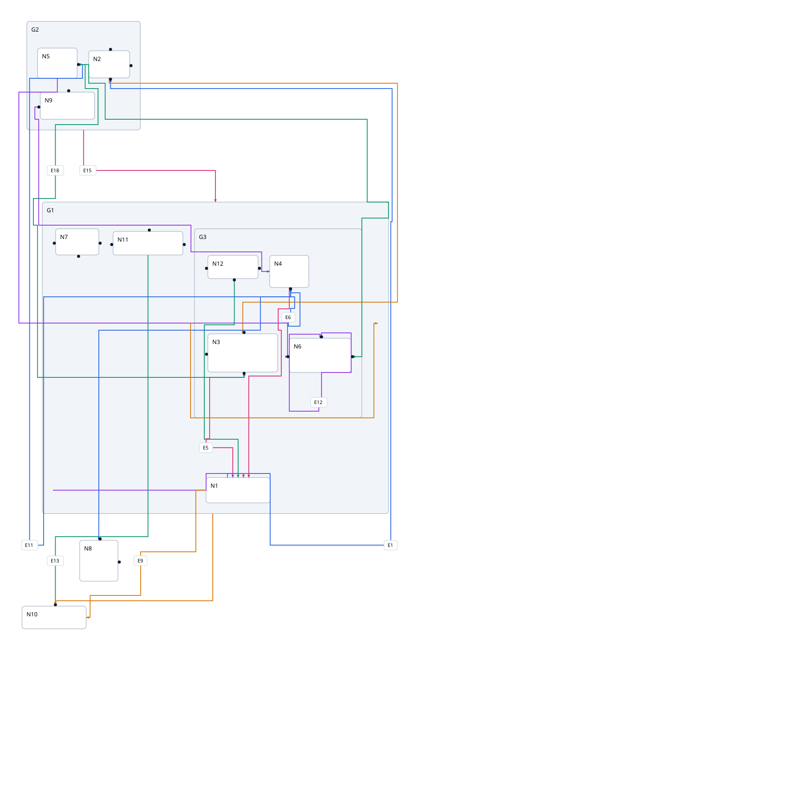
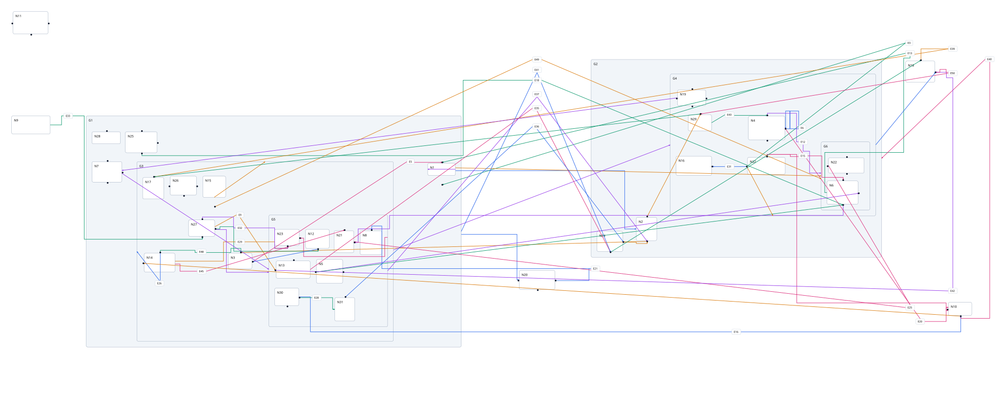
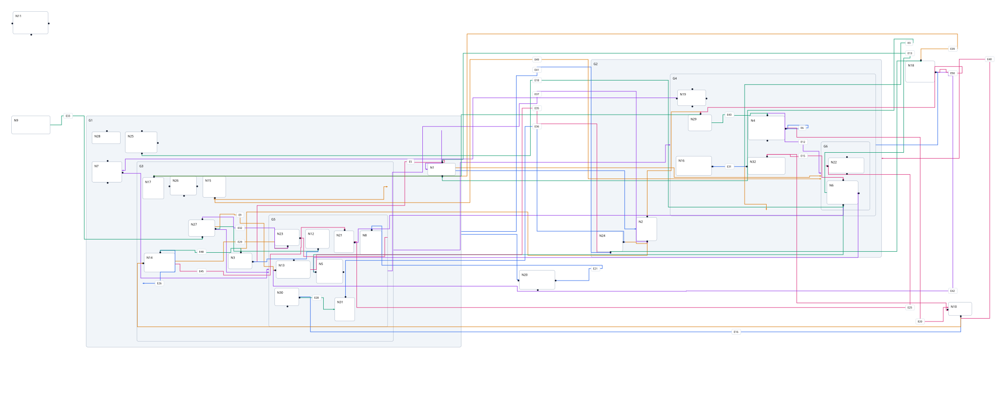

# Native routing repair

Matching Stately before/after views of corpus graphs 1 (flat), 7 (nested),
and 10 (dense hierarchy). Each pair keeps its input, seed, direction,
node/label dimensions, shared scale, and viewport. Compound positions may
change when incorrectly enlarged port geometry is corrected.

Before: origin/main at `81363b469e857650527548a5bd356c98727f378e`.
After: this branch, generated with `scripts/generate-heuristic-corpus.mjs`.

All ten input fixtures now pass checks for orthogonality, leaf-node interior
intersections, collinear self-retracing outside shared terminals, and blocked
or budget-exhausted routes. Dense graphs retain crossings and some shared
tracks; these remain aesthetic optimization work.

| Graph  | Before                         | After                        |
| ------ | ------------------------------ | ---------------------------- |
| Flat   |   |   |
| Nested |   |   |
| Dense  |  |  |
