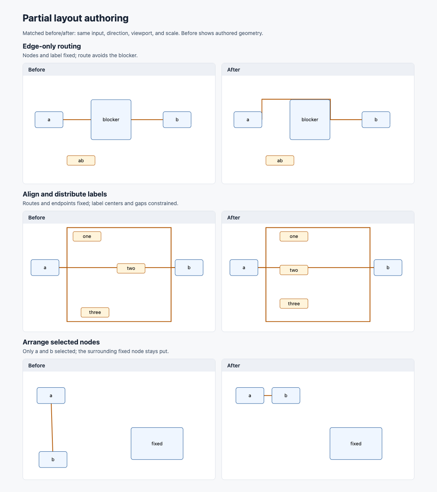

# Partial authoring proof

Regenerate from source:

```sh
pnpm exec tsx scripts/render-authoring-proof.ts
```

Open `proof.html` at 1160 × 1250 and capture the full page as `proof.png`.
`geometry.json` contains each input, request, result, field-specific patches,
and diagnostics. Each before/after pair shares a 480 × 270 graph viewport,
direction, scale, dimensions, and input. Before is authored geometry, not an
older full-layout algorithm: earlier versions rejected partial requests.

Cases: edge-only obstacle routing; label alignment and equal gaps with routes
fixed; selected-node arrangement with a stationary neighboring node.


