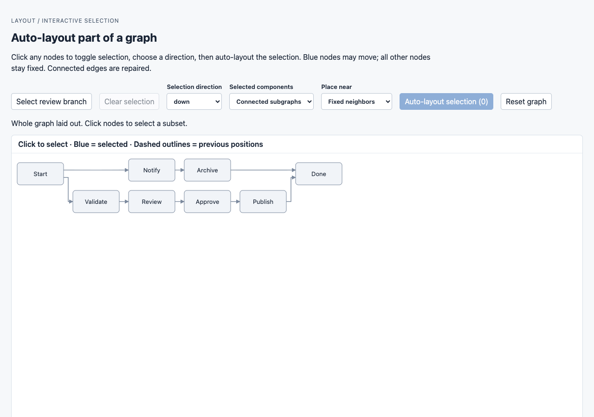
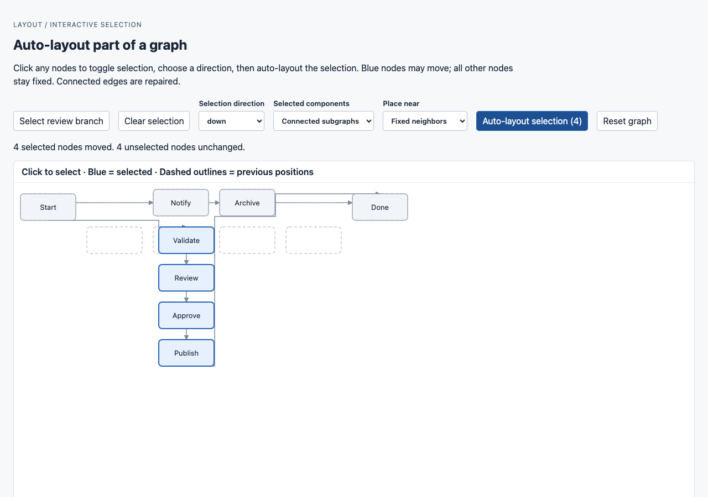

# Fixed-neighbor partial placement

`pnpm storybook` → **Layout / Partial selection / Select And Auto Layout**.
Both screenshots use the same graph, 1280 × 900 viewport, canvas origin, and scale.
In the second image, the review branch is selected, direction is `down`, selected
components are `connected`, and placement is `Fixed neighbors`. Four selected
nodes move next to their fixed neighbors; Start, Notify, Archive, and Done retain
identical coordinates and dimensions. Choosing `Original positions` places the
same branch at its prior anchor instead.

