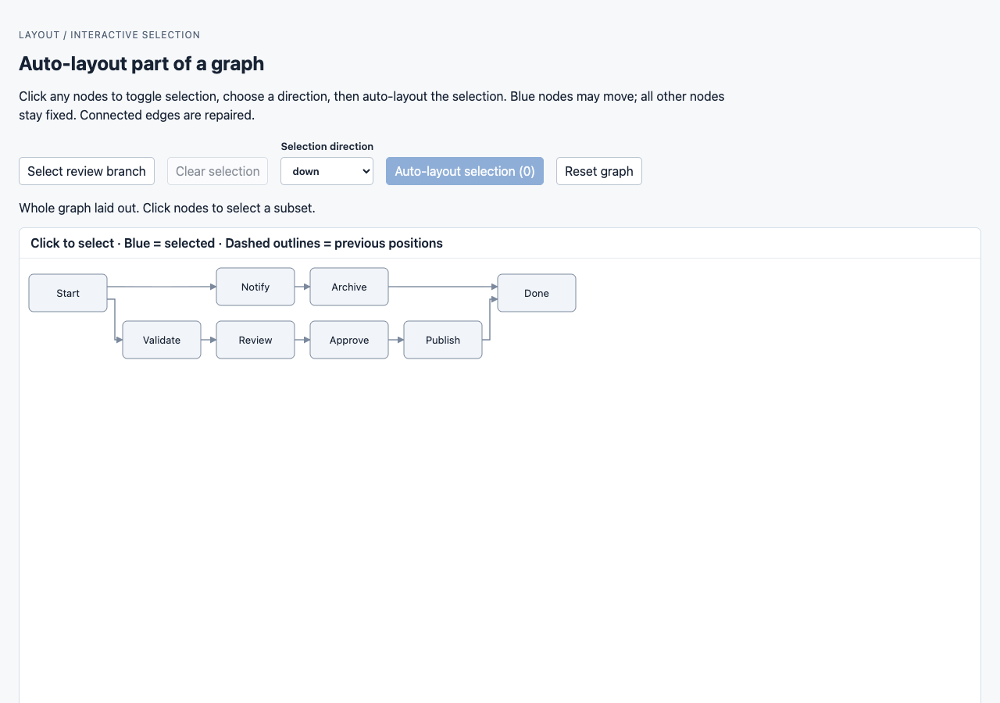
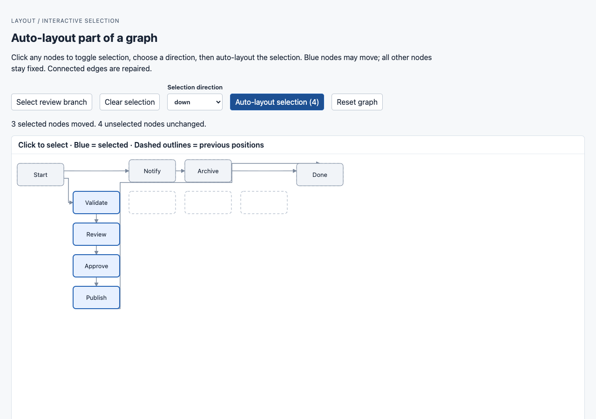

# Interactive partial selection

Run `pnpm storybook`, then open **Layout / Partial selection / Select And Auto Layout**.
The story calls full `getLayout` on load. Click Validate, Review, Approve, and
Publish, then click **Auto-layout selection (4)** with direction **down**.

Both screenshots use the same 1280 × 900 viewport, graph, and canvas scale.
Three selected nodes moved; Validate stayed anchored. Start, Notify, Archive,
and Done retained identical positions and dimensions. Dashed outlines show
positions before partial layout. Reset restores the original full layout.

