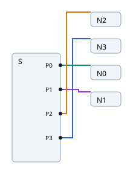
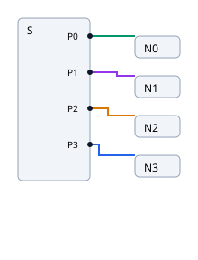
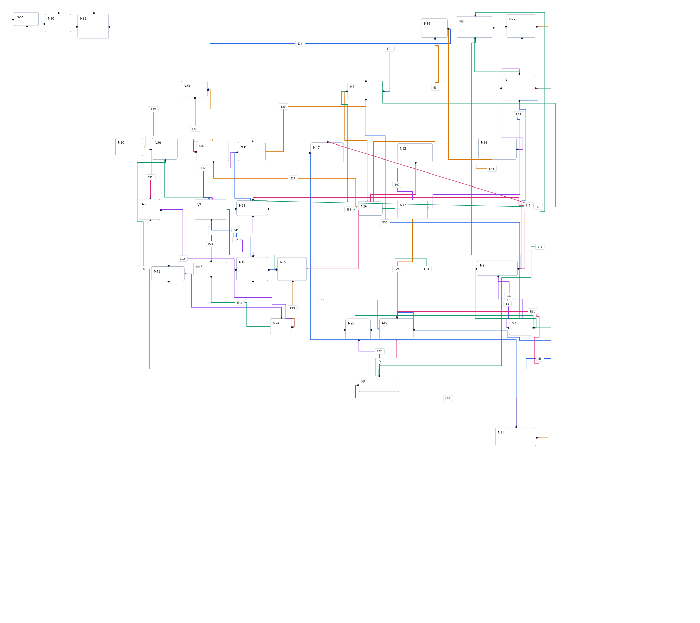
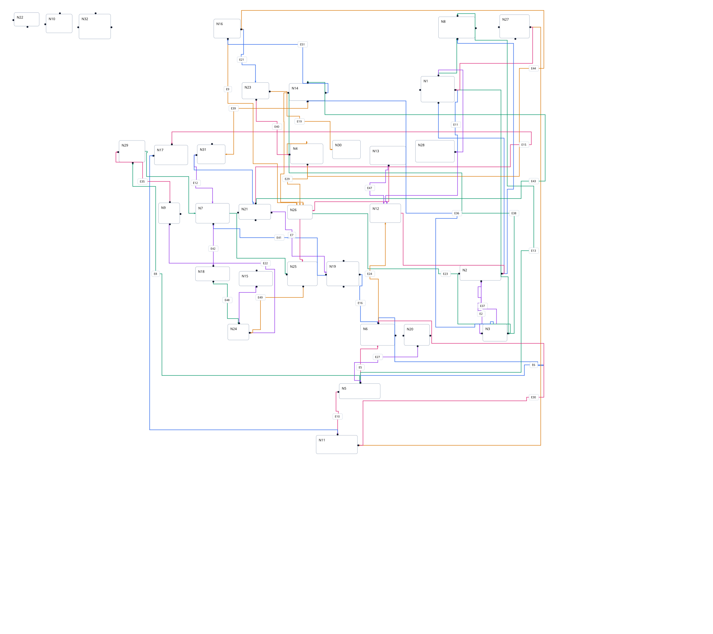
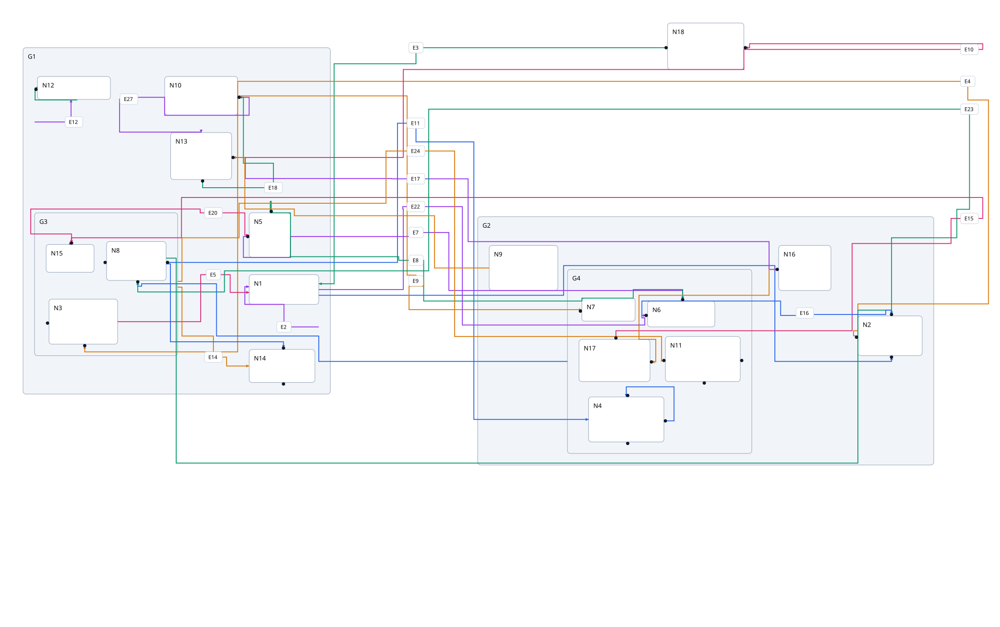
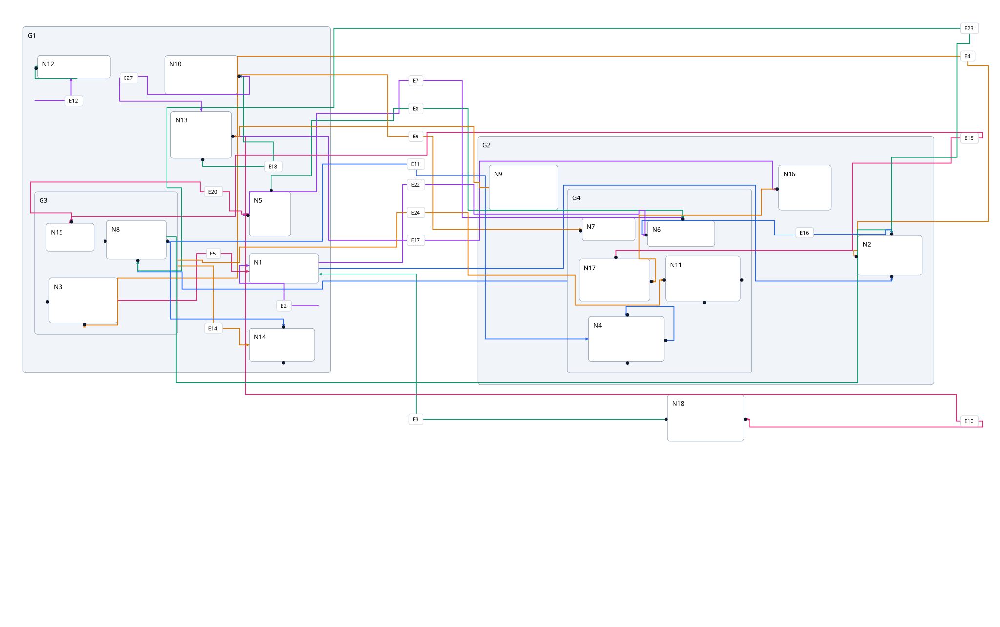
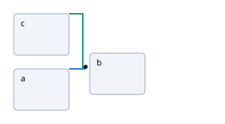
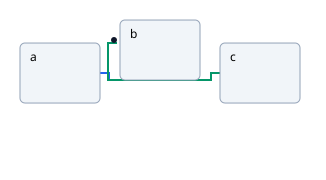
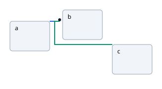

# Matching random differential proof

Random pairs: before `015b0b5`, after `ceef0b107cee294e10f1538ee9f9cea67b43e255`. The minimal fixed-port fan compares fetched main `81363b4` with the same final native source. Every pair preserves graph inputs, dimensions, direction, scale and viewport. These are visual examples, not a parity claim; [all 160 measured graphs](../../heuristics/random-progress.md) retain regressions and oracle failures.

| Case                  | Before                            | After                           |
| --------------------- | --------------------------------- | ------------------------------- |
| Fixed-port fan        |  |  |
| Seed 196613 / graph 5 |     |     |
| Seed 130363 / graph 8 |     |     |

The [fixed-port input](fixed-ports-input.json) uses native layered defaults with
`randomSeed: 1`, `layering.strategy: LONGEST_PATH_SOURCE`, and
`crossingMinimization.greedySwitch.type: OFF`. Every node uses
`portConstraints: FIXED_POS`; ports use `port.side: EAST`. The source IDs
above allow the same input/options to be replayed before and after. The random
pair inputs are reproducible from their base seed and corpus profile number.

## Mixed fixed-port feedback flow

Before: `f913778`. After: constraint orientation correction (source revision
recorded in the follow-up measurement report). Real oracle: elkjs `0.11.1`.
The [input and options](feedback-input.json) are identical across all three
panels, with one shared viewport and scale. Native previously reversed an
individual mixed-flow WEST port and placed the chain `a, c, b`; native and ELK
now both place `a, b, c`. Routing geometry still differs.

| Before                         | Native after                 | Real ELK                    |
| ------------------------------ | ---------------------------- | --------------------------- |
|  |  |  |
