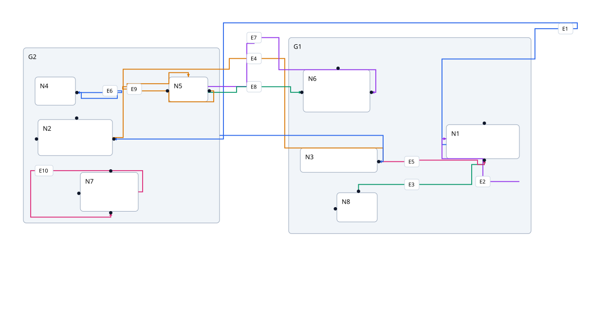
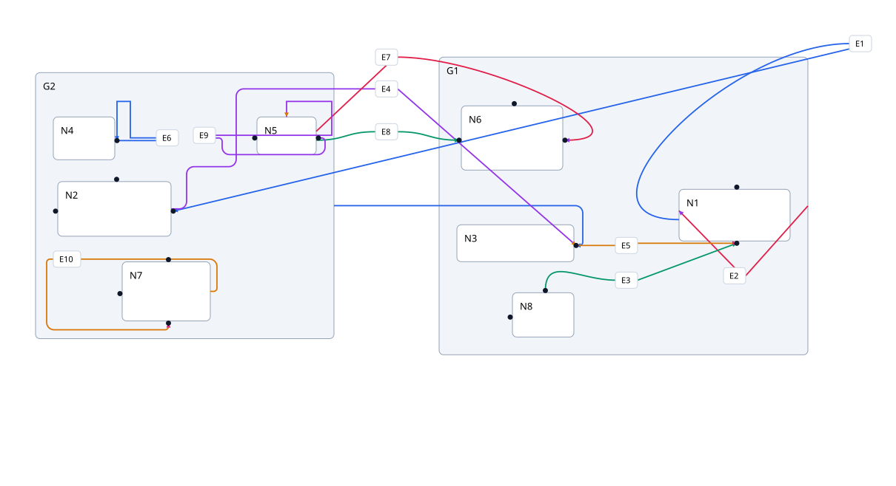

# Post-layout route replacement

Seed `20261001`, graph 6, direction right. Identical input, node/label/port
sizes, placement, compound geometry, scale, and viewport. Initial output is
native layout from `f4a7987`; after output uses this branch's
`routing: { strategy: bezierRouting }`. The test checks that replacement receives
world-space geometry without initial paths/caches and leaves placement unchanged.
This demonstrates route replacement, not an aesthetic improvement or ELK parity.

| Initial layout and routes      | Bezier replacement                |
| ------------------------------ | --------------------------------- |
|  |  |
