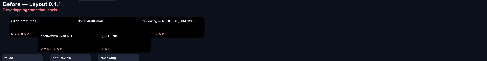
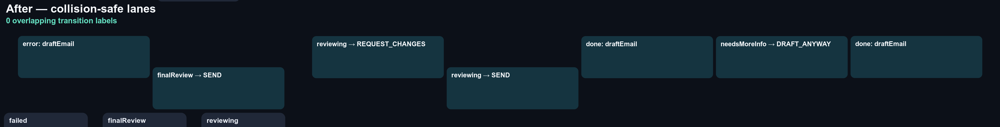

# Transition-label overlap proof

Both images use the same email-drafter ELK input, `DOWN` direction, dimensions,
scale, and viewport. Red cards in the baseline identify intersecting transition
label rectangles.

| Before (`@statelyai/layout` 0.1.1)                     | After (this change)                                |
| ------------------------------------------------------ | -------------------------------------------------- |
|  |  |

The SVG sources are generated by `scripts/render-label-overlap-proof.ts`. Build
the base revision and the current revision, then pass their `dist/elkjs/index.mjs`
paths to the script as `--before` and `--after`, with this directory as
`--output`. Convert the resulting SVGs to PNG without resizing to preserve the
shared viewport.

```sh
pnpm exec tsx scripts/render-label-overlap-proof.ts \
  --before /path/to/layout-0.1.1/dist/elkjs/index.mjs \
  --after "$PWD/dist/elkjs/index.mjs" \
  --output "$PWD/docs/proofs/transition-label-overlap"
magick -background '#0c1018' -density 144 \
  docs/proofs/transition-label-overlap/before.svg -depth 8 \
  docs/proofs/transition-label-overlap/before.png
magick -background '#0c1018' -density 144 \
  docs/proofs/transition-label-overlap/after.svg -depth 8 \
  docs/proofs/transition-label-overlap/after.png
```
